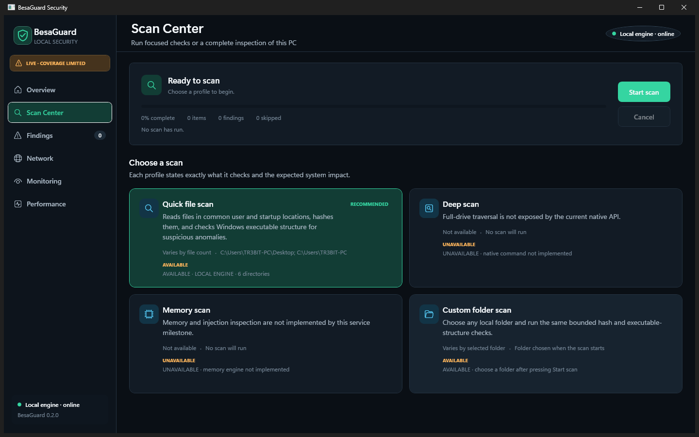
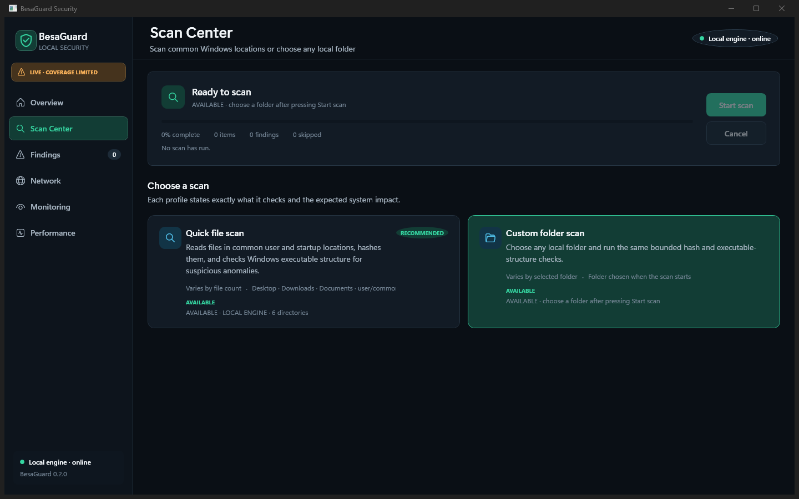

  

# BesaGuard

BesaGuard is a compact native Windows security workbench from promptedteam. The current beta provides real local, on-demand advisory scanning, persistent findings, bounded continuous observation, network/session/performance visibility, and encrypted holding copies in a dark WPF interface.

> **Beta safety notice:** BesaGuard is not yet a replacement for a mature primary antivirus. Keep an established antivirus enabled. A no-signal scan is not proof that a file or computer is clean.

## Download

Download **BesaGuard-0.8.2-win-x64.zip** from the [latest release](https://github.com/promptedteam/BesaGuard/releases/latest), verify its SHA-256 against `SHA256SUMS.txt`, extract the complete folder, and double-click `BesaGuard.exe`.

The beta is a framework-dependent portable Windows x64 build and requires the .NET 10 Desktop Runtime. It does not install a driver or Windows service. Keep every extracted file together.

## Screenshots

### Security overview

### Live scan

### Custom scan selection

## What works in this beta

- Native Windows desktop UI with custom icon, compact layouts, tray controls, contextual right-click actions, and reboot-safe build reminder.
- High-risk, fixed-drive, custom-folder, and single-file scans through the bundled Rust host.
- A verified 10-rule BesaGuard advisory catalog combined with bounded PE, script/command, shortcut, and ZIP metadata analysis.
- Persistent findings and explicit incomplete-coverage reporting.
- Bounded file-change, process/network, Windows event, session, and performance observations while the app runs.
- User-requested AES-256-GCM encrypted holding copies; originals are retained, so this is not production quarantine.
- Live in-app beta checks and SHA-256-verified portable downloads from this repository. Downloads are never silently executed.
- Optional current-user Windows startup, minimized to the tray, so bounded app-lifetime observations can begin after sign-in without installing a service.
- Bounded tray notifications for newly observed medium-or-higher scanner findings; clicking a notification opens Findings, and no automatic response is implied.

The package does **not** claim cloud reputation, kernel/minifilter interception, boot or full memory scanning, exploit prevention, automatic remediation, packet capture, privileged isolation, or commercial malware-intelligence coverage.

## Privacy

BesaGuard's beta workflows are local. Findings and encrypted holding data are stored under the current user's `%LocalAppData%\BesaGuard` directory. The app contacts GitHub only when the user presses the update button. See [PRIVACY.md](PRIVACY.md).

## Distribution and source

This public repository is the official binary distribution and documentation channel. BesaGuard's application source is private and is not included in this repository or its release archives. Third-party notices and licenses required by the distributed binary are included inside every package.

Security reports should follow [SECURITY.md](SECURITY.md).
