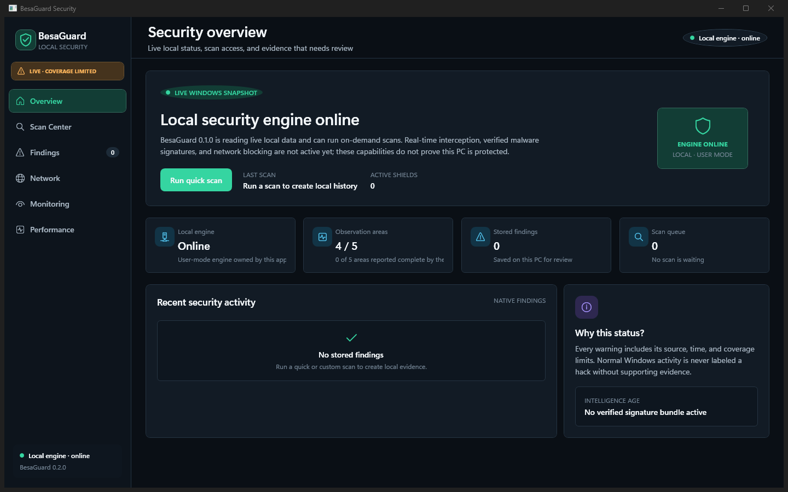
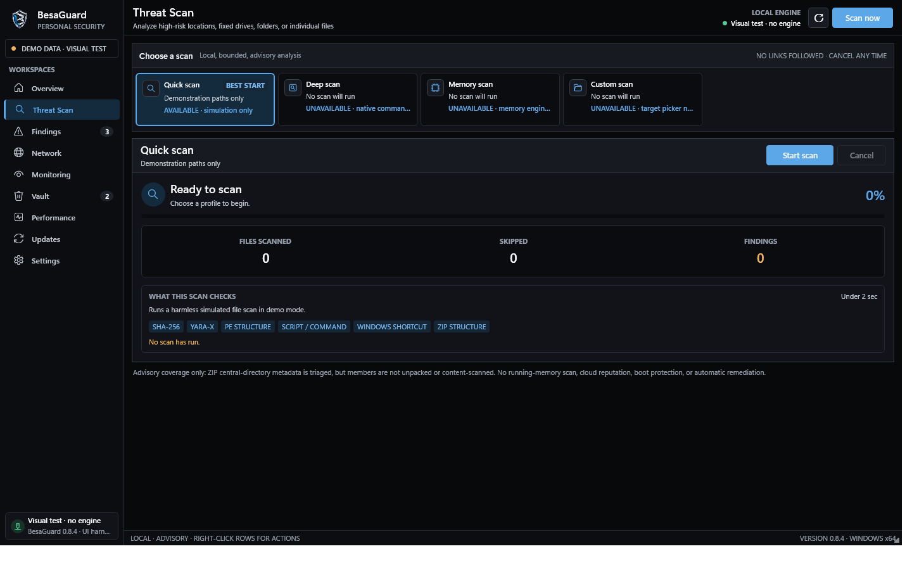
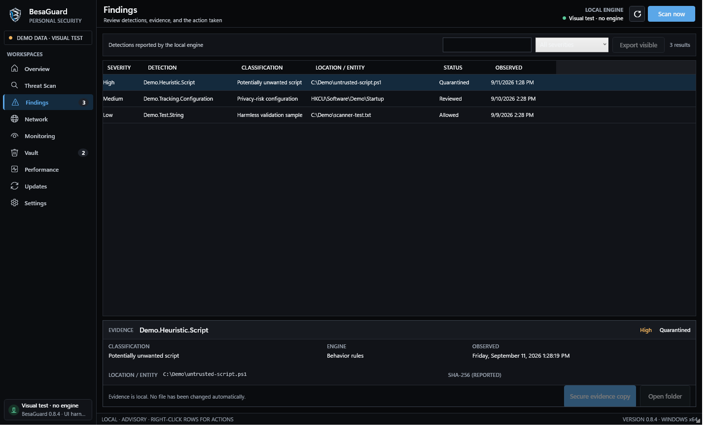
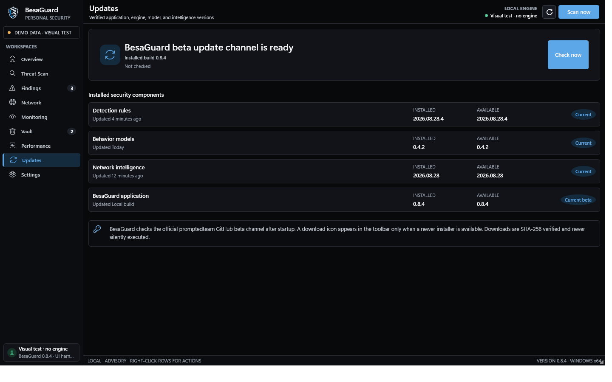

  

# BesaGuard

BesaGuard is a compact native Windows security workbench from promptedteam. The current beta provides real local, on-demand advisory scanning, persistent findings, bounded continuous observation, network/session/performance visibility, and encrypted holding copies in a dark WPF interface.

> **Beta safety notice:** BesaGuard is not yet a replacement for a mature primary antivirus. Keep an established antivirus enabled. A no-signal scan is not proof that a file or computer is clean.

## Download

Download **BesaGuard-Setup-0.8.7-win-x64.exe** from the [latest release](https://github.com/promptedteam/BesaGuard/releases/latest), verify its SHA-256 against `SHA256SUMS.txt`, and run the installation wizard.

The wizard installs BesaGuard for the current Windows user, creates a Start Menu shortcut, offers an optional desktop shortcut, and provides normal uninstall support. If the .NET 10 Desktop Runtime is missing, Setup offers to download the official Microsoft runtime. It does not install a driver or Windows service.

## Screenshots

### Security overview

### Threat scan

### Findings

### Updates and installed version

## What works in this beta

- Native Windows desktop UI with custom icon, compact layouts, tray controls, and contextual right-click actions.
- High-risk, fixed-drive, custom-folder, and single-file scans through the bundled Rust host.
- A verified 10-rule BesaGuard advisory catalog combined with bounded PE structure/import-capability, script/command, PDF active-content, Office/OOXML metadata, shortcut, and ZIP analysis.
- Advisory PE import correlations for complete process-injection, process-hollowing, and process-memory-dump primitive sets; partial API combinations remain silent.
- Advisory PDF correlations for JavaScript/automatic actions, external Launch actions, embedded active-content chains, and RichMedia metadata; stream content is not decoded.
- Advisory Office/OOXML correlations for VBA projects, macro-extension mismatches, embedded active payload names, and ActiveX parts; member content is not decompressed.
- Persistent findings and explicit incomplete-coverage reporting.
- Bounded file-change, process/network, Windows event, session, and performance observations while the app runs.
- User-requested AES-256-GCM encrypted holding copies; originals are retained, so this is not production quarantine.
- Automatic startup checks against the public beta manifest, a toolbar download indicator shown only for a newer build, SHA-256-verified installer downloads, and an explicit Open Downloads action. Version 0.8.7 fixes the Windows verification-to-download file handoff. Installers are never silently executed.
- Installed build version shown in the app footer and Updates page.
- Optional current-user Windows startup, minimized to the tray, so bounded app-lifetime observations can begin after sign-in without installing a service.
- Bounded tray notifications for newly observed medium-or-higher scanner findings; clicking a notification opens Findings, and no automatic response is implied.

The package does **not** claim cloud reputation, kernel/minifilter interception, boot or full memory scanning, exploit prevention, automatic remediation, packet capture, privileged isolation, or commercial malware-intelligence coverage.

## Privacy

BesaGuard's beta workflows are local. Findings and encrypted holding data are stored under the current user's `%LocalAppData%\BesaGuard` directory. The app contacts GitHub once after startup to check the beta manifest and again only when the user requests a download. See [PRIVACY.md](PRIVACY.md).

## Distribution and source

This public repository is the official binary distribution and documentation channel. BesaGuard's application source is private and is not included in this repository or its release archives. Third-party notices and licenses required by the distributed binary are included inside every package.

Security reports should follow [SECURITY.md](SECURITY.md).
